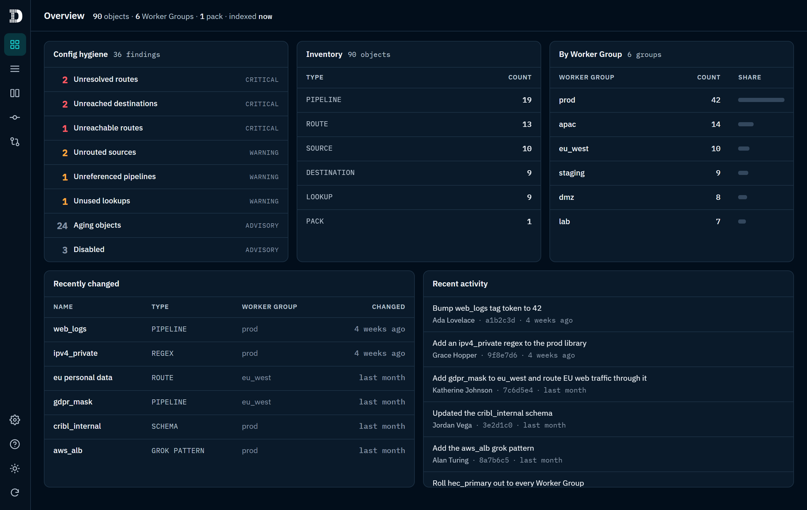
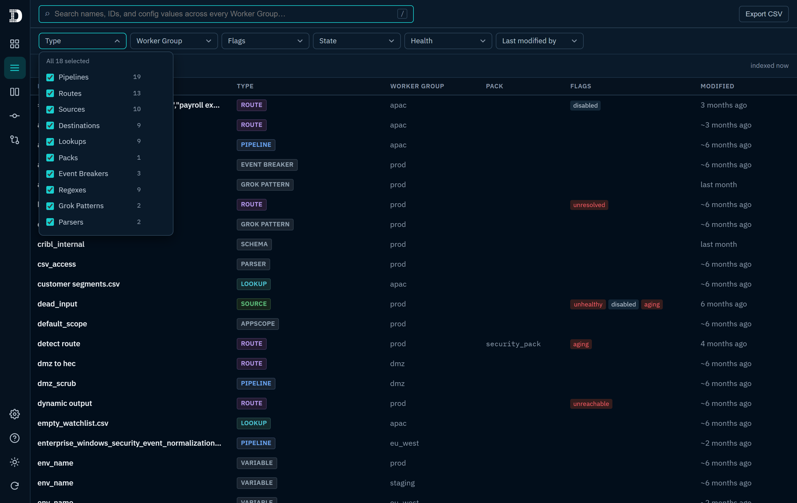
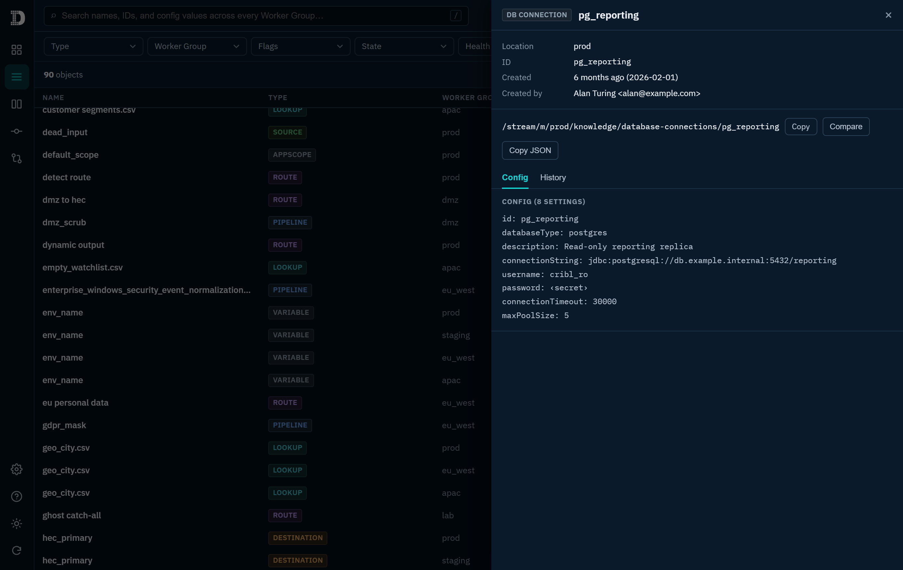
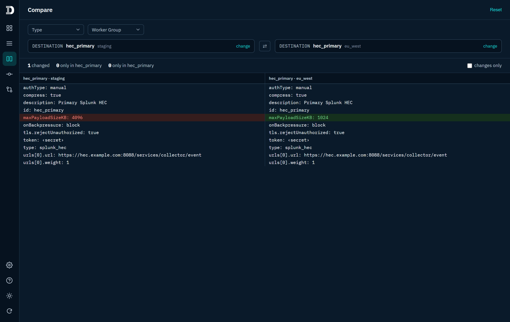
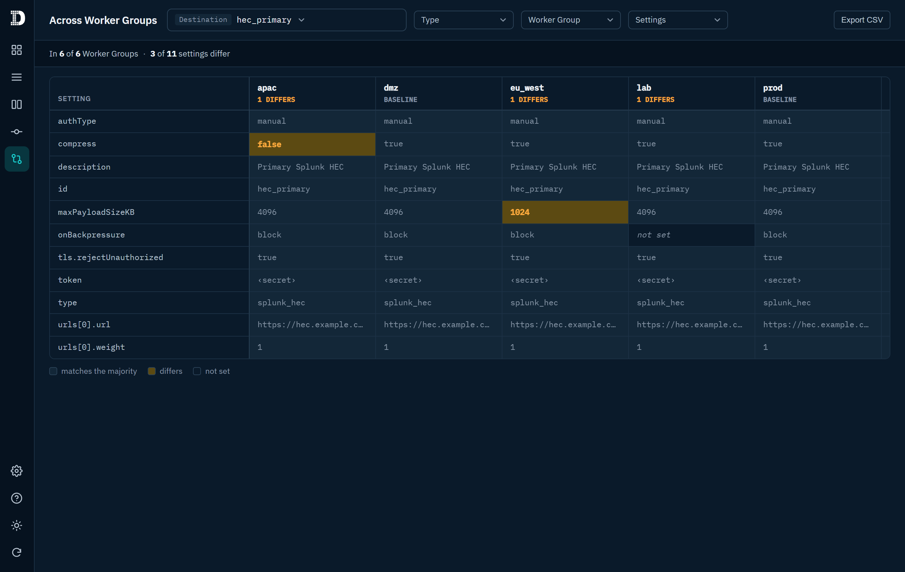
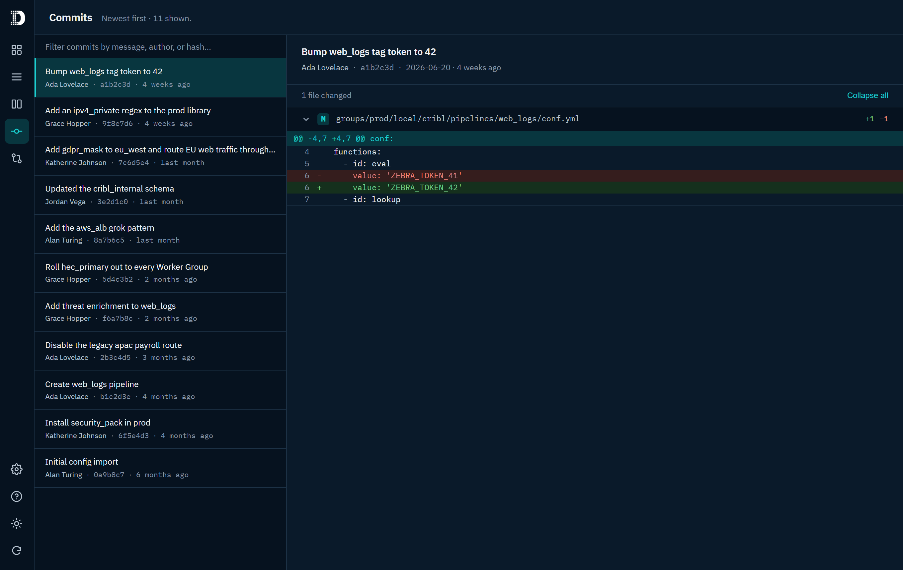

# Config Quest for Cribl

Configuration and knowledge object visibility, search, and hygiene for **Cribl**, running
natively inside the **Cribl App Platform**. It indexes every Pipeline, Route, Source,
Destination, Lookup, and Pack, plus library (Knowledge) objects like Event Breakers,
Regexes, Grok patterns, Parsers, Schemas, Data-scan rules, and Variables, across all Worker
Groups — then makes the whole configuration searchable, inventoried, and auditable in one
place.

Today the app reads only: it never creates, modifies, or deletes a Cribl resource, and the
only writes it makes are to its own app storage.

_(Screenshots use the bundled demo fixtures — no real environment data.)_

> **Intended for administrators and operators.** Config Quest for Cribl surfaces configuration,
> who last changed what, change history, and hygiene across every Worker Group — an environment-wide
> administrative view. It is meant for those who manage the Cribl deployment (admins,
> platform operators, consultants), not for end users, and is best installed with access
> scoped accordingly.

## Features

- **Search everything** — full-text over object names, IDs, and the actual config
  values (flattened `jsonPath: value` leaves), across every Worker Group.
- **Browse & filter** — the full inventory as a table, filterable by Type, Worker
  Group, Pack, Flags, State, Health, and Last modified by. Each filter starts with every value
  selected, offers an "only" shortcut to isolate one, and restores everything when the
  last value is cleared — the same behaviour across Browse, Compare, and Differences.
  Export to CSV.
- **Config hygiene** — findings for unreferenced pipelines, unresolved and unreachable
  routes, unused lookups, unrouted (dead-end) sources, dead-end destinations, and
  disabled or stale objects. Each finding has a configurable **severity tier**
  (critical / warning / advisory).
- **Health** — per-object operational status (healthy / unhealthy) from the Leader's
  status endpoints, where available.
- **Change history** — git-backed last-changed date, the author of that change, and per-object diffs
  (Cribl versions config in git on the Leader), plus a **Recent activity** commit feed.
  Covers every object type, including library (Knowledge) objects: schemas, grok
  patterns, and parquet schemas map to their own per-object files, while regexes,
  parsers, event breakers, AppScope configs, variables, and data-scan rules map through
  their shared tables. Shared files (route/input/output and the library tables) are
  narrowed to the object that actually changed, and a pack's first deploy — which
  rewrites the whole `local` copy — is reconciled against the pristine `default` so
  siblings aren't mis-flagged as changed. An object git has no edit for still shows a
  **Created** date — the commit that added its file, or its pack's install / group's
  creation — so nothing is left blank.
- **Open in Cribl** — every object's detail drawer links straight into the Leader UI:
  pipelines, sources, and destinations to the object; Knowledge objects (regexes, grok,
  parsers, schemas, event breakers, variables, DB connections, …) and lookups to the
  specific item under the Knowledge menu, inside packs too.
- **Overview** — an at-a-glance operator readout: hygiene, inventory, health, recently
  changed objects, and recent commits. Every card drills into a filtered Browse view.
- **Compare** — a side-by-side, per-setting diff of any two objects of the same type,
  with Type / Worker Group filters.
- **Commits** — the environment's full git change log as a browser: filter the log by
  message, author, or hash, then pick any commit to see everything it changed, file by file
  (each collapsible, with add/delete counts and per-file diffs; large commits are capped).
  Reached from the nav, an Overview activity item, or an object's History tab (its commit id
  is a link).
- **Differences (across Worker Groups)** — pick one object that exists in several Worker
  Groups and see its config as a **settings × groups matrix**: every group an equal-width
  column, every setting a row, each cell that departs from the majority value highlighted,
  and each group's drift count in its header. The full configuration is shown — settings
  that match everywhere are listed too, so the view is just as readable when nothing drifts.
  Type and Worker Group filters narrow which objects you can pick (Worker Group also scopes
  which groups the comparison covers), and a Settings filter narrows the rows once an object
  is chosen. Deploy-substituted secrets are normalized so a per-group token doesn't read as
  drift. Reached from the nav or an object's "Compare across groups" action.
- **Settings** — configure severity tiers, the stale-object threshold, theme, and
  optional automatic periodic re-indexing (handy for an always-on oversight screen).
  Choices persist to the KV store.
- **Help** — in-app guidance on the views and filters, plus an API reference of exactly
  which Cribl calls the app makes and why.

## Screenshots

**Browse & filter** — search names, IDs, and config values across every Worker Group; filter by
type, group, pack, flags, state, health, or who last touched it.

**Object detail** — location, the "Created"/last-modified attribution, a one-click "Open in Cribl"
path, and the full config with secrets masked (`password: ‹secret›`).

**Compare** — any two objects of the same type, setting by setting; the one changed value is
highlighted and deploy-substituted secrets read as unchanged rather than a false difference.

**Differences across Worker Groups** — one object as a settings × groups matrix, every group a
column and each value that departs from the majority highlighted (`not set` and masked secrets
handled too).

**Commits** — the environment's git change log, filterable by message, author, or hash, with each
commit's per-file diff.

## How it works

- **Read-only & sandboxed.** Reads config through `window.CRIBL_API_URL` only — no
  hardcoded endpoints or credentials. The only writes are to the app's own KV store.
- **Degrades gracefully.** Change history needs versioning access and Health needs
  status access on the Leader; when either isn't granted, that surface hides itself and
  everything else keeps working.
- **Config-graph aware.** The environment is modelled as a reference graph
  (`src/data/graph.ts`); reachability findings (dead-end sources, unreachable routes)
  come from that graph, not just orphan detection.
- **Declared permissions.** Every Cribl API path the app uses is declared in
  `config/policies.yml`, so admins see exactly what it will access at install time.
- **Deep-linkable.** The current view — search, filters, sort, open object, and page —
  lives in the URL, so any state is shareable and bookmarkable and the Back button walks
  your view history.

## Install

Config Quest for Cribl packages as a standard Cribl App Platform app —
`configquest-<version>.tgz`. Build the package with `npm run package` (see
[Develop](#develop)) or use a released artifact. Cribl supports several ways to install an
app; use whichever fits your workflow. At install time you'll be shown the permissions the
app requests (declared in `config/policies.yml`) to review before confirming.

- **Upload in the Cribl UI.** Open the **Apps** page in your Cribl UI, choose to add an app,
  and upload the `configquest-<version>.tgz` package.
- **From a URL.** Point Cribl at a URL that serves the `.tgz`; Cribl downloads and installs
  it — convenient for a package hosted on an internal server or a release page.
- **From a git repository.** Install directly from a repository using a
  `git+<repository-url>` source, for pulling from an internal git host.
- **Via the REST API.** Install programmatically with `POST /api/v1/apps` on the Leader; the
  request's `source` accepts an uploaded filename, a URL, or a `git+`URL, and
  `POST /api/v1/apps/preinstall-check` validates a package first. See your Cribl API
  reference for the request shape.

On first open the app indexes your configuration (a one-time build); subsequent opens load
instantly from its cached index. Because the index and your settings are stored per app,
they are shared across everyone who uses the app in your organization.

## Stack

React 19 + Vite + TypeScript (strict) with Vitest and oxlint. IBM Plex Sans / Mono are
self-hosted (bundled, no external font requests). No runtime dependencies beyond React.

## Layout

- `src/data/` — pure, testable data layer: normalize, graph, crossref, coverage
  (findings), cross-group difference, and git age / history / activity / commit-detail.
- `src/ui/` — React components and hooks (Overview, Browse, Compare, Commits,
  AcrossGroups, Settings, Help, NavRail, DetailPanel, …).
- `config/` — `policies.yml` (Cribl API allowlist) and `proxies.yml` (external API
  declaration).

## License

Licensed under the **Apache License, Version 2.0** — see [`LICENSE`](./LICENSE).
